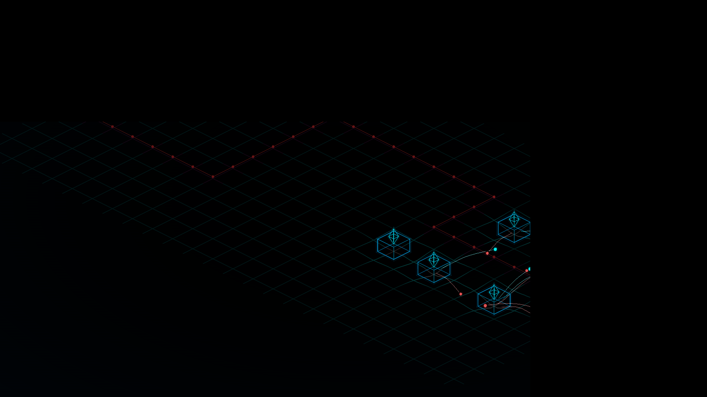

# Gridlock Portage

Port of [Gridlock](https://github.com/Laconiq/gridlock) (Unity) to **C#/.NET 8 + Raylib-cs** -- a from-scratch rewrite with no Unity dependency.



## What is Gridlock?

An **isometric grid-based Tower Defense** with a neon/Geometry Wars aesthetic. Place towers, configure them with a modular slot system, and defend your objective against enemy waves.

**Core mechanic**: each tower has mod slots that accept traits (Heavy, Swift, Homing, Split...) and events (OnHit, OnKill, OnEnd...) that chain into nested projectile pipelines. Adjacent trait pairs unlock synergies (Heavy+Heavy = Railgun, Frost+Frost = Blizzard, etc.).

## Stack

| | |
|---|---|
| **Runtime** | .NET 8 (C#) |
| **Rendering** | [Raylib-cs](https://github.com/ChristopherSzatmary/Raylib-cs) 7.0.2 |
| **Debug UI** | [rlImGui-cs](https://github.com/raylib-extras/rlImGui-cs) 3.2.0 (ImGui.NET) |
| **Shaders** | GLSL 330 (custom bloom, grid warp, post-processing) |
| **Audio** | Raylib audio API |

## Build & Run

Requires [.NET 8 SDK](https://dotnet.microsoft.com/download/dotnet/8.0).

```bash
cd src/Gridlock
dotnet run
```

Publish a self-contained binary:
```bash
dotnet publish -c Release -o ../../publish
```

## Controls

| Input | Action |
|---|---|
| Left click | Place tower / Select tower |
| Right click | Deselect |
| Scroll | Zoom |
| Space | Start wave |
| Escape | Close mod panel |

## Mod System

Towers have 5 configurable slots. Drop in **traits** and **events** to build projectile behaviors:

**Traits** modify the projectile:
- **Heavy** -- +50% damage, -30% speed, +30% size
- **Swift** -- -25% damage, +50% speed
- **Split** -- fires a fan of extra projectiles
- **Homing** -- tracks nearest enemy
- **Pierce** -- passes through up to 3 enemies
- **Bounce** -- redirects to nearest untouched enemy
- **Wide** -- AoE damage on impact

**Elements** apply status effects on hit:
- **Burn** -- damage over time
- **Frost** -- slow (Blizzard synergy = stun)
- **Shock** -- chain lightning to nearby enemies
- **Void** -- deals % of current HP
- **Leech** -- heals objective

**Events** spawn sub-projectiles on triggers:
- **OnHit**, **OnKill**, **OnEnd**, **OnPulse**, **OnDelay**, **OnOverkill**
- **IfBurning**, **IfFrozen**, **IfLow** -- conditional triggers

**Synergies** (adjacent pairs):

| Combo | Name | Effect |
|---|---|---|
| Heavy + Heavy | Railgun | Free pierce (+2) |
| Swift + Swift | Machinegun | 2x fire rate |
| Frost + Frost | Blizzard | Stun on hit |
| Shock + Shock | Tesla | 3x chain count |
| Homing + Swift | Missile | Instant homing |
| Heavy + Wide | Meteor | 2x AoE radius |
| Split + Split | Barrage | Extra projectiles |
| Leech + Heavy | Vampire | 40% life steal |

## Architecture

```
Program.cs                  -- Entry point, Raylib window
Core/GameLoop.cs            -- Main loop (FixedUpdate 60Hz + variable render)
Mods/ModProjectile.cs       -- Projectile lifecycle (move, collide, hit, spawn children)
Mods/Pipeline/              -- Stage-based effect pipeline (Configure -> OnUpdate -> OnHit -> PostHit -> OnExpire)
Mods/Pipeline/Stages/       -- One file per effect (20 stages)
Combat/SpatialHash.cs       -- Grid-based spatial hashing for sweep collision
Enemies/EnemyPool.cs        -- Object pooling for enemies
Rendering/LineBatch.cs      -- Batched rlgl line renderer
```

Sub-projectiles are created inline (matching Unity's `Instantiate` pattern) and registered immediately via a static callback -- no spawn buffer, no frame delay.

## Benchmarking

```bash
# 30s stress test: 8 towers near spawn, Split+Pierce preset, no VSync
dotnet run -- --benchmark --frames 1800

# Profile with CSV export
dotnet run -- --profile
```

## License

Private project.
